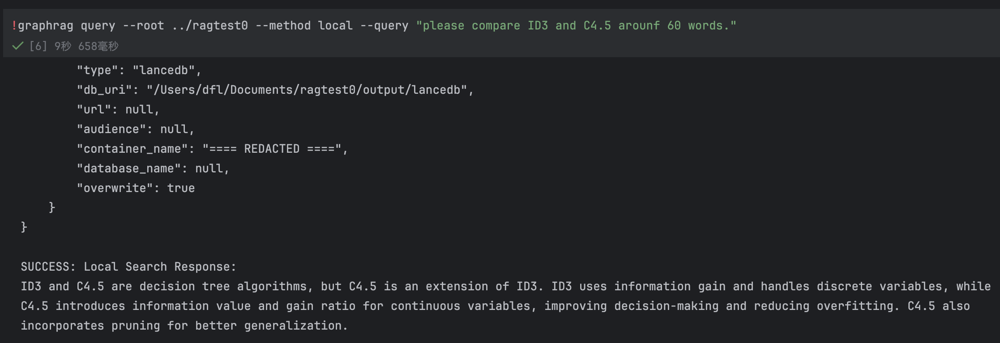

# GraphRAG-Enhanced LLM Question Answering System

## Overview
This system leverages GraphRAG (Graph-based Retrieval Augmented Generation) to enhance LLM capabilities for constructing high-quality question answering systems.

## Data Source
- **Input File**: `./input/ID3_and_C4.5_Decision_Tree_Modeling_Process.txt`  
  Contains technical descriptions of ID3 and C4.5 decision tree algorithms

## Model Configuration
**Platform**: GLM (BigModel.cn)

```env
API_BASE=https://open.bigmodel.cn/api/paas/v4
CHAT_MODEL=glm-4-flash
EMBEDDING_MODEL=embedding-3
```

> **API Key Requirement**:  
> Obtain your API key from [GLM Developer Portal](https://open.bigmodel.cn/usercenter/proj-mgmt/apikeys)

## System Demonstration

